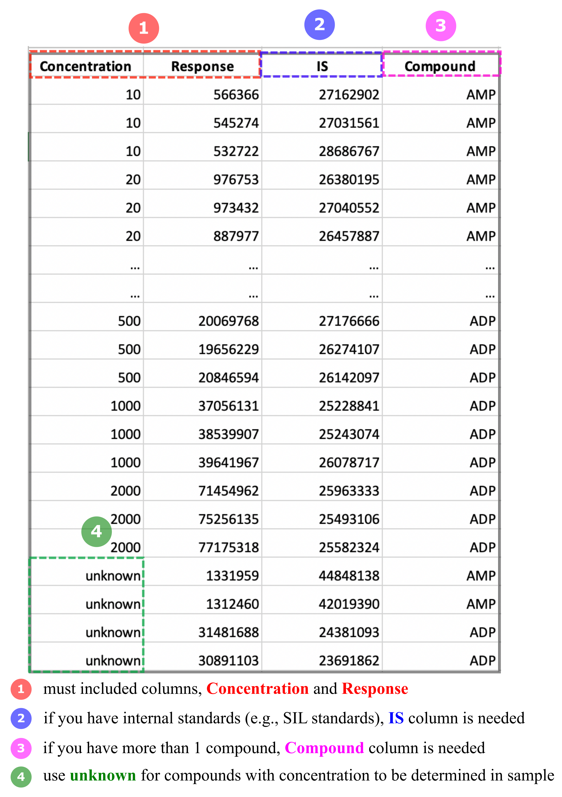

# Welcome to CCWeights  

<b>CCweights</b> is a web-based tool (also an R package) to help the user evaluate and select the appropriate weighting factors for linear calibration curves in bioanalytical assays, e.g., LC-MS for targeted analysis.

Although the least-squares regression and curve weighting are well-established statistical methods, the `Test-and-Fit` strategy is still widely used for the selection of calibration curves and the weighting factors in bioanalytical community. With the `Test-and-Fit` strategy, an incorrect weighting factor can be easily selected because this strategy is based on the analyst’s subjective interpretation.

<b>CCweights</b> serves as a user friendly and systematically 

---

## Workflow

Below is an overview of CCWeights workflow:

<em>Figure 1. Schematic workflow of CCWeights</em>

** Data upload:** 

- Data must contain at least two columns, one is named as `Concentration`, one is named as `Response`. In case you have more than one compounds in your sample, you need to have a third column called `Compound`. If you used stable isotope labeled standards, please information named `ID`.
  
- Please refer to the example data in the **Upload Data** tab or Figure 2 for the data format.
  
- You can also download the templates here to prepare your data.

<em>Figure 2. Data format requirement</em>

**2. Homoscedasticity Test**

**3. Weighting Factor Evaluation**

**4. Calibration**

---

### About CCWeights

This is Weights

---

