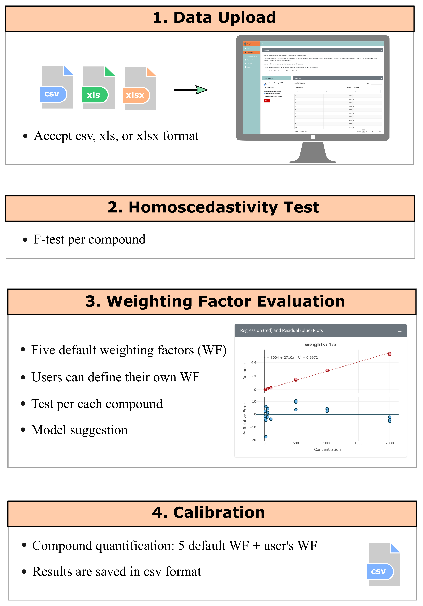

# Welcome to CCWeights  

Although weighted linear regression is well-established statistical methods, the `Test-and-Fit` strategy is still widely used for the selection of calibration curves and the weighting factors in bioanalytical community. With the `Test-and-Fit` strategy, an incorrect weighting factor can be easily selected because this strategy is based on the analyst’s subjective choice.

<b>CCweights</b> is a web-based tool (also an R package) for automated assessment and selection of weighting factors for accurate quantification using linear calibration curve.

<b>CCweights</b> serves as a user friendly and systematically 

---

# Workflow

Below is an overview of CCWeights workflow:

<em>Figure 1. Schematic workflow of CCWeights</em>

**Data upload:** 

- Data must contain at least two columns, one is named as `Concentration`, one is named as `Response`. In case you have more than one compounds in your sample, you need to have a third column called `Compound`. If internal standards are used (e.g.. stable isotope labeled internal standards), please include another column named `IS`.
  
- You can refer to the example data in the **Upload Data** tab or **Figure 2** for the data format.
  
- You can also download the templates **[<b>here</b>]()** to prepare your data accordingly.

<em>Figure 2. Data format requirement</em>

- Once data file is successfully uploaded, you can perform data analysis following the steps shown in Figure 1.

---

# About CCWeights

CCWeights is publicly available on **[<b>CRAN repository</b>](https://cran.rproject.org/web/packages/CCWeights)**, with source code available on **[<b>GitHub</b>](https://github.com/YonghuiDong/CCWeights)** under a GPL-3 license. The web application can be run locally from R console using a simple command `runGui()`. Alternatively, the web application can be freely accessed for direct online use at **[<b>https://CCWeights.shiny.com</b>](https://CCWeights.shiny.com</span)**. 

---

